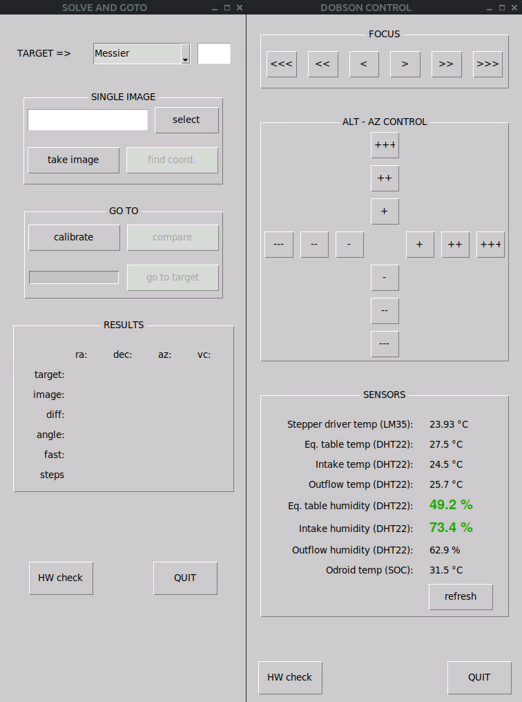

# INTRODUCTION TO TELESCOPE MOUNTS

When it comes to telescopes, there are two kind of mounts:

* equatorial mounts (with a polar axis) which can easily follow stars as the Earth rotate, therefore often used for astrophotography which requires long exposures.
* alt-az mounts (with an azimut and an altitude axis) which are more suited for visual observations. 

Equatorial mounts are most of the time commercial as opposed to DIY and a good choice for small telescopes or refractors (<150mm diameter). For larger telescopes, there are alternative solutions such as "horse-shoe" mounts but those are more complex to build, heavier and bulky (hence more difficut to transport).

Dobson telescope are a type of alt-az mounted Newton telescope (primary mirror + eleptical flat secondary mirror reflecting light at 90 degrees to the focuser). It's a popular design as it is not too heavy, and it is easier to build. However, in order to do some astrophotography with a Dobson telescope, it must be installed on an equatorial table, which can follow the sky as the Earth rotates.
 

# PROJECT DESCRIPTION

This project is about developing code that makes astrophotography possible with a Dobson telescope installed on an equatorial table. The objective is to:

  * drive the equatorial table in order to compensate the Earth rotation and follow a target in the sky
  * drive the telescope axis: ALT ("altitude" or up-down) and AZ (Azimut or pivot) axis in order to refine the telescope position. This is achieved using either an Infra-Red remote or a Python-based interface
  * control a focus motor
  * display sensor values (temperature and humidity)
  * assist the observer in reaching the target by offering a goto solution
  * stay warm indoors and control the telescope via WiFi (thus also avoiding cables !)

The telescope is home-made, starting from a blank disk of glass, all the way to fitting a camera for astrophotography. The whole project is being documented on [instructables.com](https://www.instructables.com/Dobson-Telescope-on-Equatorial-Table-WRITING-STILL/).

# HARDWARE COMPONENTS

**equatorial table** 

* arduino Uno
* 1 bigeasydriver [http://www.schmalzhaus.com/BigEasyDriver/](URL)
* powersupply
* LM35 temperature sensor
* DHT22 temperature and humidity sensor
* 2 30x30mm fans (IN and OUT)
* polyimide heating element
* RGB LED, connectors, switches
* 1 Nema 17 stepper motor
 
**rocker**

* arduino Mega
* Odroid N2+ (Ubuntu Mate) with WiFi dongle
* 2 bigeasydriver
* split-ring
* LM35 temperature sensor
* 2 DHT22 temperature and humidity sensor (air IN and air OUT)
* 2 30x30mm fans (IN and OUT)
* polyimide heating element
* IR sensor
* LEDs, connectors, switches
* 2 Nema 17 stepper motors
 
**secondary cage**

* stepper motor 28-BYJ48 (focus)
* Crayford focuser (3D printed - credits to Jérôme, brother-in-law)
* ASI ZWO 294MC Pro cooled [https://astronomy-imaging-camera.com/product/](URL)

# ODROID CONFIGURATION

The Odroid N2+ (4Gb RAM) runs Ubuntu Mate with Python3. Additional packages include:

* astap (for plate solving) [https://www.hnsky.org/astap.htm](URL)
* lm-sensors (read Odroid heat sensors)
* kstars (image acquisitions with EKOS) [https://edu.kde.org/kstars/](URL)
* python3-tk (GUI)
* python3-serial (USB communication with Arduino)
* arduino IDE
* camera-zwo-asi python [https://pypi.org/project/camera-zwo-asi/](URL)
* VNC for remote access

# EQUATORIAL TABLE: ARDUINO UNO CODE
The arduino Uno is in charge of the following tasks:

  * driving the equatorial table stepper motor precisely the right speed to follow the stars
  * detecting the status of limit switches to stop the motor when the equatorial table reaches the endpoint
  * change the colour of an RGB LED according to the temperature of the bigeasydriver chip

# ROCKER: ALT-AZ ARDUINO MEGA CODE
The rocker arduino mega code is in charge of the following tasks:

  * detect input from the IR sensor and activate the focus, ALT or AZ motors accordingly
  * listen to input on the serial USB line from the Odroid Python code (get and return sensor values or activate stepper motors and return a "done" signal)
  

# ROCKER: PYTHON CODE
There are two distinct Python3 scripts, which are automatically launched at login and positionned next to each other, to the right of the screen, so that kstars / ekos can take up the left half of the screen.

**DOBSON CONTROL**

This script displays a GUI which allows the user to perform the following actions:

  * focus (two speeds)
  * move ALT and AZ motors (3 speeds)
  * request and display sensor values
  * detect if Arduino is connected: if not, display message and disable all buttons

**SOLVE AND GOTO**

This script displays a GUI which allows the user to perform the following actions:

  * get user input of a target (select catalog and reference number)
  * take or/and a single image (thanks to camera-asi-zwo)
  * get the sky coordinates of this image (thanks to astap)
  * calibrate the telescope (the user must first manually move and point the telescope as near as possible to the target, then the script moves the motors several times, taking and solving images each time and works out how many ALT and AZ motor steps correspond to how many degrees in sky coordinates)
  * compare telescope position and target coordinates
  * automatically move to the target
  * detect if the camera and the arduino are connected, if not disable buttons and display a message

# ASTROPHOTOGRAPHY RESULTS

* acquisition: EKOS (based on indi client-server)
* principle: take a number of exposures (up to 30s in the absence of an auto-guiding solution) and stack them (using software such as SIRIL)

Here's an example of the capabilities of the telescope (Messier 42: Orion Nebula)
More images on [astrobin](https://www.astrobin.com/users/d.legourrierec/)

# WHAT'S NEXT ?

* clean up the code (ALT called dec for declination, review python command to import modules)
* v2. implement a function for autofocus and manage backlash
* v3. autoguiding with a refractor added to one of the side bearings

